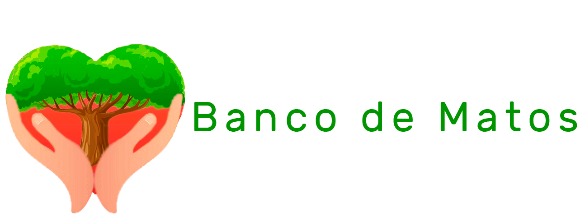

[Veja nosso Pitch](https://www.youtube.com/watch?v=3bveAjKVvx0&feature=emb_title)

## Inspiração

O aumento dos focos de queimada na Amazônia gerou uma enorme repercussão nos noticiários brasileiro e internacional, além de provocar uma onda de protestos ao redor do mundo.

### Por que fazem queimadas na Amazônia?

A motivação para fazer queimada na Amazônia é de cunho econômico. Geralmente, são agricultores que utilizam o fogo para preparar a terra para cultivo ou criadores de animais que recorrem às queimadas para fazer pastos. 

Os danos causados pela queimada na Amazônia, como destruição da vegetação, solo improdutivo, perda de fauna e flora, agravamento do efeito estufa e aquecimento global são muito graves e comprometem o meio ambiente como um todo, incluindo a própria população. 

Segundo os [dados do INPE](http://queimadas.dgi.inpe.br//queimadas/portal) para o ano de 2018. No Brasil houve um total de 151.889 focos de incêndios, em 2019 206.884 focos de incêndios e em 2020 estamos em 19.710 focos de incêndios registrados até 12/06/2020.

## Como o aplicativo foi desenvolvido

Como no nosso grupo cada um tinha uma especialidade diferente na área da programação, para que todos pudessem participar do desenvolvimento, nós utilizamos o [Kodular](https://www.kodular.io/) que é uma plataforma que usa o serviço do Google App Engine para criar aplicativos Android de forma rápida através de blocos iterativos. O Kodular nada mais é do que uma versão mais atualizada do MIT App Inventor. Para nós programadores, que dominamos a lógica de programação, foi muito fácil aprender a usar a plataforma do Kodular e foi bem mais efetivo, para fins de Hackathon, do que tentar aprender a usar o Android Studio em dois dias. Nós compreendemos totalmente que, em um ambiente corporativo, o Kodular não é uma ferramenta efetiva.

O nosso aplicativo possui uma API do [Firebase](https://firebase.google.com/) da Google, que fornece um banco de dados hospedado em um servidor WEB e uma API da [Cloudinary](https://cloudinary.com/), que possibilita armazenar arquivos de mídia na nuvem.

No aplicativo, o usuário pode preencher um formulário informando onde e quando houve uma queimada. No formulário o usuário pode por seu nome, email, data em que houve a queimada, local da queimada, também pode incluir fotos e adicionar uma descrição. Após submetido, o formulário vai para o banco de dados do Firebase, caso haja conexão com a internet, ou vai para um banco de dados local, através do TinyDB, e depois os dados desse banco local vão para o banco do Firebase, assim que houver conexão com a internet.

No campo de localização no formulário, o usuário pode escolher o local no mapa, clicando em um botão que abre um visualizador do Google Maps embutido onde o usuário pode clicar em um local e o aplicativo vai preencher o endereço do onde ele clicou.

Além disso, o usuário pode ver os formulários submetidos ao banco numa tela que exibe de forma legível cada formulário, com foto (caso haja) e todos os dados preenchidos. Também há uma tela que exibe uma galeria com todas as fotos submetidas em formulários ao banco de dados web. O usuário pode clicar em uma foto para expandí-la.

## Desafios

Implementar a API do Firebase, para usar o banco de dados web e criar a exibição do banco de forma legítima, foi um desafio, pois não conhecíamos o Firebase.

## Metas importantes alcançadas

Para nós, ter conseguido implementar o aplicativo para que ele funcione de forma offline foi um passo importante, pois dessa forma tornamos o aplicativo muito mais acessível para o nosso público alvo, que são moradores de áreas mais remotas no norte do Brasil, onde o acesso a internet é mais restrito e onde se concentram as queimadas

## Próximos passos

Os próximos passos para o aplicativo seria disponibilizar de forma efetiva esse banco de dados para órgãos públicos do meio ambiente, como o Ministério do Meio Ambiente, Ibama, ONGs como o Greenpeace e a comunidade científica no geral, afim de ajudar no mapeamento e coleta de informações acerca das queimadas e desmatamentos das preciosas florestas brasileiras.

## O que cada um fez
#### Pedro Moreira Grisolia 
Implementação da tela de formulário e através do uso de back-end do aplicativo foram produzidas funções que conectam as informações captadas do formulário com a API do banco de dados Firebase, e banco de dados local, caso não haja internet, fazendo uso do banco de dados TinyDB. Além disso, o serviço de armazenamento de imagens em nuvem foi implementado com a API do Cloudinary.
#### Luis Moreira da Costa
 Levantamento e analise de requisitos e debugs da versões de teste. Auxilio da implementação do TinyDB , auxilio de implementação das telas de transição e preenchimento dos servidores do Firebase com dados de teste.

#### Patrick Lavigne da Silva
Designer do projeto, desenvolvedor da logo principal do aplicativo. Responsável por toda documentação do projeto, edição e apresentação do mesmo através do vídeo.  O desenvolvimento do aplicativo em grupo, possibilitou conhecimento sobre a linguagem utilizada na criação do aplicativo.

#### Felipe Costa Gomes de Oliveira
 Foi realizado o desenvolvimento de aplicações front-end construindo a tela inicial do aplicativo que contém a apresentação do projeto. Considerando o back-end, foi produzido o bloco que recebe informações salvas no banco de dados e que serão exibidas na tela de Banco de Dados.

